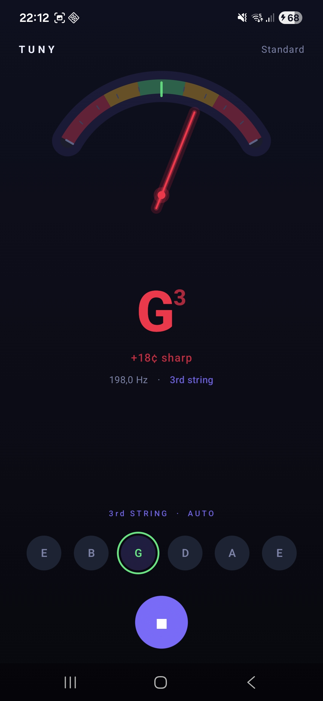
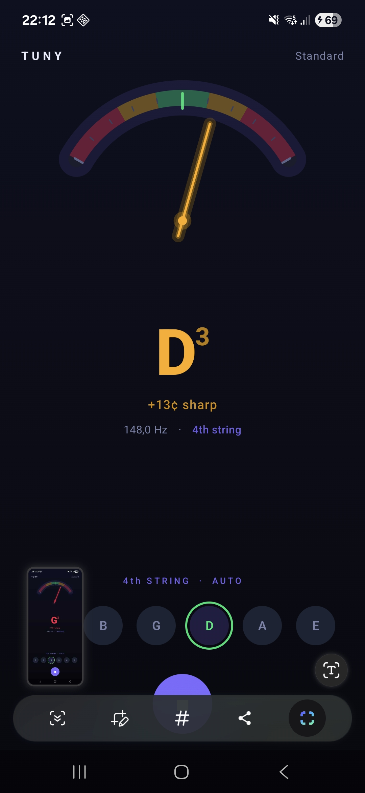
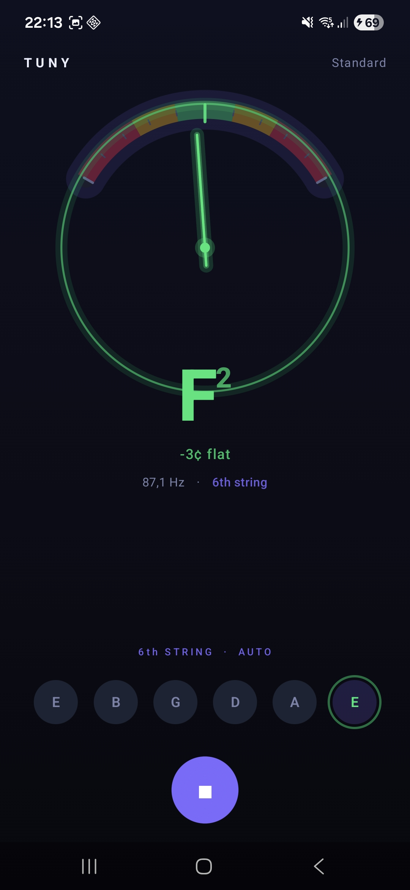

# Tuny

A clean, real-time guitar tuner for Android built entirely with Jetpack Compose.


---

## Features

- **Real-time pitch detection** — sliding 4096-sample analysis window advances every 1024 samples (~23 ms) so the needle tracks pitch changes the moment you tighten or loosen a peg
- **Accurate algorithm** — McLeod Pitch Method (NSDF + first-peak selection) avoids the octave errors that plague simple autocorrelation, especially on E4, B3, G3 and D3
- **Auto string detection** — automatically identifies which of the six standard strings you are plucking; pulsing ring highlights the detected string in real-time
- **Manual string lock** — tap a string button to pin the tuner to that string; tap again to release
- **Signal hold** — the last detected note stays on screen for ~2 seconds after the string goes quiet, giving you time to read the result
- **Neon dark UI** — custom Canvas gauge with coloured tuning zones, glow needle, and an in-tune ring that appears when you're within ±5 ¢

---

## Screenshots

<p align="center">
  
  
  
</p>

---

## Architecture

The project follows **Clean Architecture** with an **MVI** presentation pattern, all in a single `:app` module.

```
domain/          Pure Kotlin — no Android dependencies
  model/         GuitarString, TuningResult
  repository/    TunerRepository interface
  usecase/       GetTuningResultUseCase  (freq → TuningResult, conflated Flow)

data/            Android implementation details
  audio/         PitchDetector  (NSDF algorithm)
  repository/    TunerRepositoryImpl  (AudioRecord, sliding window)

presentation/    Jetpack Compose + MVI
  TunerIntent    Sealed interface of user actions
  TunerUiState   Single immutable state snapshot
  TunerViewModel AndroidViewModel — processes intents, owns the StateFlow
  ui/
    TunerScreen            Root composable, permission launcher
    components/
      TuningGauge          Canvas arc gauge with animated neon needle
      StringSelector        Six string buttons with auto-highlight pulse
```

**MVI flow:**
```
User action / audio event
       │
       ▼
 TunerIntent  ──►  TunerViewModel.handleIntent()
                          │
                          ▼
                   MutableStateFlow<TunerUiState>
                          │
                          ▼
                    Compose UI (collectAsStateWithLifecycle)
```

---

## How the pitch detection works

1. **AudioRecord** captures mono PCM at 44 100 Hz, read in 1024-sample hops
2. A 4096-sample sliding window (≈ 93 ms of audio) is maintained in memory
3. A **Hann window** is applied to reduce spectral leakage
4. The **Normalized Square Difference Function (NSDF)** is computed for lags 116 – 630 (≈ 70 – 380 Hz, covering all six standard strings with ±50 ¢ headroom)
5. The **first local maximum** that exceeds 80 % of the NSDF global peak is selected as the fundamental period — this "first-peak" rule avoids sub-octave artifacts present in raw-ACF detectors
6. **Parabolic interpolation** refines the integer lag to sub-sample accuracy
7. The detected frequency is converted to a MIDI note number, cents deviation, and nearest standard guitar string

---

## Tech stack

| Layer | Technology |
|---|---|
| Language | Kotlin 2.2.10 |
| UI | Jetpack Compose (BOM 2026.02.01), Material3 |
| Architecture | Clean Architecture, MVI |
| Async | Kotlin Coroutines, Flow |
| Audio | Android `AudioRecord` |
| Build | Gradle 9.4.1 (Kotlin DSL), AGP 9.2.1 |

---

## Requirements

- Android **9.0 (API 28)** or higher
- Microphone permission (requested at runtime)

---

## Building

```bash
# Clone
git clone https://github.com/andreiflo94/tuny.git
cd tuny

# Debug build
./gradlew assembleDebug

# Install on connected device or emulator
./gradlew installDebug

# Run unit tests
./gradlew test
```

Open the project in **Android Studio Meerkat** or newer (AGP 9.x requires it).

---

## Project structure

```
app/src/main/java/com/heixss/guitartuner/
├── data/
│   ├── audio/PitchDetector.kt
│   └── repository/TunerRepositoryImpl.kt
├── domain/
│   ├── model/
│   ├── repository/
│   └── usecase/
├── presentation/
│   ├── TunerIntent.kt
│   ├── TunerUiState.kt
│   ├── TunerViewModel.kt
│   └── ui/
│       ├── TunerScreen.kt
│       └── components/
│           ├── TuningGauge.kt
│           └── StringSelector.kt
└── ui/theme/
```

---

## License

```
MIT License

Copyright (c) 2026

Permission is hereby granted, free of charge, to any person obtaining a copy
of this software and associated documentation files (the "Software"), to deal
in the Software without restriction, including without limitation the rights
to use, copy, modify, merge, publish, distribute, sublicense, and/or sell
copies of the Software, and to permit persons to whom the Software is
furnished to do so, subject to the following conditions:

The above copyright notice and this permission notice shall be included in all
copies or substantial portions of the Software.

THE SOFTWARE IS PROVIDED "AS IS", WITHOUT WARRANTY OF ANY KIND, EXPRESS OR
IMPLIED, INCLUDING BUT NOT LIMITED TO THE WARRANTIES OF MERCHANTABILITY,
FITNESS FOR A PARTICULAR PURPOSE AND NONINFRINGEMENT. IN NO EVENT SHALL THE
AUTHORS OR COPYRIGHT HOLDERS BE LIABLE FOR ANY CLAIM, DAMAGES OR OTHER
LIABILITY, WHETHER IN AN ACTION OF CONTRACT, TORT OR OTHERWISE, ARISING FROM,
OUT OF OR IN CONNECTION WITH THE SOFTWARE OR THE USE OR OTHER DEALINGS IN THE
SOFTWARE.
```
